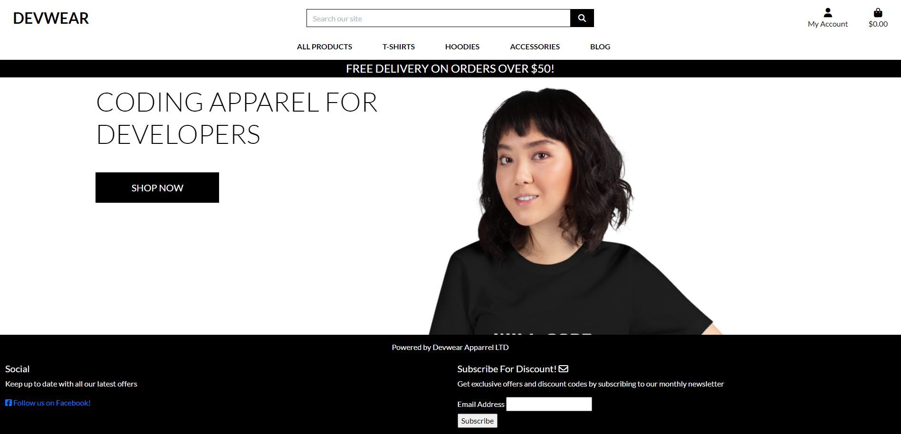

# DEVWEAR - Portfolio Project 5
Welcome To DevWear,
The Apparel Store for Developers!

## Responsive Layout

The layout is responsive and has been tested with various screen sizes. This screenshot was taken with the ui.dev/amiresponsive website.

[Link to live Website:](https://devwear-0c4ac54770df.herokuapp.com)

## Link to Repository
[Link to Repository:](https://github.com/BrendanCooney/devwear)

When designing this site, I wanted to keep the design simple. Due to time constraints I kept much of the CSS used in our walktough project. I do like the design and it is simple and clean. The goal of the site was to show that it can be quite simple to design and generate apparel products for Ecommerce

Build and SetupTechnologies:
This Ecommerce Project uses:
 HTML,
 CSS'
 Javascript' 
 Django,
 DJ Databases, 
 Psychopg Libraries,
 Postgres,
 Stripe Payments, 

## Business Model
The DevWear Business model is a Business to Consumer (B to C) business model. The business sells apparel and accesories to software developers. 

Currently the site is an exmple of the possible live site. Please do not make any purchases as you will not get a product yet. 
Please only use the testing cards on the [Stripe Website](https://stripe.com/docs/testing).

## Ecommerce Business Model & Marketing Strategy
This site sells goods to individual customers, and therefore follows a Business to Customer model. It is a simple B2C strategy, as it focuses on individual transactions, and doesn't need anything such as monthly/annual subscriptions.

The Target market for the business is web developers. 

Social media will be used to build a community of users around the business, and boost site visitor numbers, especially when using larger platforms such a Facebook.

A newsletter list will be used by the business to send regular messages to site users. For example, what items are on special offer, new items in stock, updates to business hours, notifications of events, and much more!

Facebook Ads will be used to grow the list. This will be done by sending potential customers to the Landing Page Sign up form through a link. 

Below are some images of the Market Research done for the project:

## Product Design
All products were designed by myself with Canva and Printful. Most of the designs have been created in black and white. All designs have only two colours keeping them simple and getting the message accross clearly. 

Each image was created as below and then imported into printful to create mockups.

The Mockups were then converted into T-Shirt images for the store.

## Typography 

The Lato font family was used when creating and working on this project. I used Lato on Canva to produce the logo for the brand which matches the Lato Logo font used in the header of the site for the logo.

## Agile Development Process:

GitHub Projects
GitHub Projects served as the Agile tool for the Devwear project. Github used correctly  with the right tags and project creation/issue assignments can work nicely for project management. 

Below you can see the clearly planned out user stories and completed stories on the KANBAN Board. 

Through it, user stories, issues, and milestone tasks were planned, then tracked on a weekly basis using the basic Kanban board.

## User Stories
I used Excel to create a user story template and continued to create all user stories in Github projects.

### User Story List

USER STORY: <Navigate the Store Menu>#1
As a site visitor I can Navigate the Store Menu so that **See the Products and buy a product **

USER STORY: <Navigate the Store Products>#2
As a **Site Visitor ** I can Navigate the Products so that **See the Prices **

USER STORY: <Navigate the Categories>#3
As a Site Visitor I can Navigate the Product Categories so that **See the Categories **

USER STORY: <Easily view the total of my purchases >#4
As a Site User/shopper I can **Easily view the total of my purchases ** so that Avoid spending too much

USER STORY: <Easily register for an account >#5
As a Site user/Shopper I can **Easily register for an account ** so that **I have a personal account and view my profile **

USER STORY: <Easily Log in or Log out >#6
As a Site user/Shopper I can **Easily Log in or Log out ** so that Access my personal information

USER STORY: <Easily recover my password incase I forget it >#7
As a Site user/Shopper I can Easily recover my password in case I forget it ** so that ** I can recover access to my account

USER STORY: <Receive an email after registering >#8
As a Site user/Shopper I can **Receive an email after registering ** so that **Verify that my account registration was successful **

USER STORY: <Have a personalised user profile >#9
As a Site user/Shopper I can **Have a personalised user profile ** so that **View my personal order history **

USER STORY: <Sort the list of available products>#10
As a Shopper I can Sort the list of available products so that ** I can easily identify the best priced and categorically sorted products**

USER STORY: <Sort a specific category of a product>#11
As a Shopper I can Sort a specific category of a product so that I can find the best-priced product in a category or sort products in a category.

USER STORY: <Sort multiple categories simultaneously>#12
As a Shopper I can Sort multiple categories simultaneously so that Find the best priced product across categories

USER STORY: <Search for a product by name or description>#13
As a Shopper I can Search for a product by name or description so that I can find a specific product I'd like to purchase

devwear #14
USER STORY: <Easily see what Ive serached for and the number of results>#14
As a Shopper I can Easily see what I've serached for and the number of results so that I can quickly decide whether the product I want is available

USER STORY: <Easily select the size and quantity of a product>#15
As a Shopper I can Easily select the size and quantity of a product so that Ensure I don’t accidentally select the wrong product quantity or size

USER STORY: <View Items in my bag to be purchased>#16
As a Shopper I can View Items in my bag to be purchased so that Identify the total cost of my purchase before checkout

USER STORY: <Adjsut the quantity of a product when purchasing it>#17
As a Shopper I can Adjsut the quantity of a product when purchasing it so that Easily make changes to my purchase before checkout

USER STORY: <Easily enter my payment information>#18
As a Shopper I can Easily enter my payment information so that I can checkout quickly with no hassles

USER STORY: <Feel my personal and payment information is safe and secure>#19
As a Shopper I can feel secure so that ** I can confidently provide the needed information to make a purchase **

## Search Engine Optimization (SEO) & Social Media Marketing

The Seo is foucussed on people that like apparel and that are developers. The appropriate key words have been added to the Meta Section of base.html 

* Short-tail(head terms) keywors have been used
* Long-tail keywords have also been used.

### Sitemap 
[XML Sitemaps](https://www.xml-sitemaps.com/) was used to create the sitemap.xml file. 

### Robots

There is a robots.txt file present in the project. 

``User-agent: *
Disallow: /accounts/
Disallow: /profiles/
Disallow: /bag/
Sitemap: https://devwear-0c4ac54770df.herokuapp.com/sitemap.xml
``

## Social Media Marketing 

With Social Media making it fairly quick to get a decent media presence and exposure to the market a Facebook page is a great place to star. This is a live Facebook site and can be accessed here:

[Devwear Apparel Ltd](https://www.facebook.com/profile.php?id=61553925042570)

Below are some screenshots of the Facebook Page:

## Newsletter Marketing:
I have used the subscribe button at the bottom of the base.html file as advised in the course work this subscribes the user to a mailchimp database. This is temporary and will be upgraded at a later stage. 

## Data Model
The below graphic provides an idea of the data model. The Model has been updated to include a Blog which active as well as a comment model and post sharing system for the Blog.

## Additional Changes

I have added more functionality to the blog application on the site. The following has been added:
* The ability to share a post by email 
* Here is an example of the process 
* Here is an example to the shared post being recieved 
* This shows the success message after the post was shared 

* The ability for a user to add a comment to a post 
* Here is an example of someone adding a comment to a blog post 
* This is followed by a rendered comment message 
* The comment then shows up on the blog 

## Deployment

The live deployed application can be found deployed on [Heroku](https://devwear-0c4ac54770df.herokuapp.com)

The below methods were used to Deploy the project. 

## Code Institute Template
1. Click the 'Use This Template' button.
2. Name your repository and write a description (optional).
3. Click the 'Create Repository from Template' to create the repository.
4. Click the 'GitPod' button to create a new workspace.
5. When working on the project, ensure to open the workspace from GitPod, this will open your previous workspace ratehr than creating a new one.
6. Use the following commands to commit your work:
* 'git add' adds all the modified files to a staging area.
* 'git commit -m "Write commit message"' commits the changes to the local repository.
* 'git push' pushes all your committed changes to the GitHub repository.

## Django Setup 

1. In the terminal enter, pip3 install 'django<4'.
2. Then enter, django-admin startproject your project name
3. You will see the django project folder, including settings.py and urls.py.
4. Back to the terminal, enter touch .gitignore.
5. In the .gitignore file enter, *.sqlite3 and *.pyc and pycache
6. Run the project by entering python3 manage.py runserver to check it is running well.
7. Your page should show a rocket with 'The install worked successfully! Congratulations!' below it.
8. Back in the terminal CTRL + C to quit the server.
9. To migrate enter, python3 manage.py migrate.
10. To create a superuser enter, python3 manage.py createsuperuser.
11. Provide username, email and password.
12. Then, git add . in the terminal
13. Then, git commit -m "your commit message"
14. Finally, git push to push the changes.

## ElephantSQL Database:

This project uses ElephantSQL for the PostgreSQL Database.

1. Open ElephantSQL.
2. Register or Login.
3. Click 'Create New Instance'. Create a name and select a region.
4. Confirm new instance by clicking 'Create Instance'.
5. Click the instance you created.
6. Copy the URL to the clipboard.
7. Paste it into your DATABASE_URL = "enter url here" in .env file.

## Heroku Setup

Open Heroku.
1. Register or Login.
2. Click 'Create New App'.
3. Enter app name and select the region.
4. Click 'Create App'.
5. Under the 'Deploy' tab, click 'Connect to GitHub'.
6. Enter your GitHub credentials.
7. Search for your repository and click 'Connect'.
8. In the 'Settings' tab, scroll to 'Reveal Config Vars' and copy the ElephantSQL URL from the .env file.
9. In config vars, set PORT to 8000 and add the SECRET_KEY from the .env file.

## Stripe Setup:

1. Register for a Stripe account.
2. Go to 'Developers' on 'Dashboard'.
3. Go to 'API Keys' to view public and secret key.
4. In .env file add STRIPE_PUCLIC_KEY AND STRIPE_SECERET_KEY.
5. Copy in public and secret keys from Stripe.
6. Head to Heroku and open the app.
7. Click on 'settings' and 'Reveal Config Vars'
8. Add the STRIPE_PUCLIC_KEY AND STRIPE_SECERET_KEY with their keys from Stripe.

## Amazon AWS Setup: 

1. Create a Amazon AWS account.
2. Open S3 application and create a bucket.
3. Select an AWS Region.
4. Uncheck the 'Block All Public Access' setting and acknowledge that the bucket will be public.
5. In 'Properties', go to the 'Static Website Hosting' and click 'Edit'.
6. Turn on 'Static Website Hosting' and set index.html and errors.html values.
7. In 'Permissions', click 'Edit' on the CORS configuration.
8. Edit 'Bucket Policy' and generate and set configuration 'Bucket Policy'.
9. Go to 'Access Control List' and set list object permission for everyone.
10. Open IAM application and set up a user group.
11. Click on 'Policies' and 'Create Policy'.
12. Click on the JSON tab and import a pre-built Amazon policy called AmazonS3FullAccess.
13. Set following settings in JSON tab.
14. Click 'Review Policy', and provide name and description then 'Create Policy'.
15. Navigate to 'Groups' then 'Permissions' and 'Add Permission' then 'Attach Policy'.
16. Click 'Add User' and create one.
17. Add the user to the group and download the CSV with the user's access credentials.
18. Add the AWS code in settings.py with an environment variable called USE_AWS.

## Google Mail:

1. Create a Gmail account.
2. Login and go to settings and click Other Google Account Settings.
3. Turn on two-step verification following the steps to enable it.
4. Once verified click on app passwords. Select 'Other' and provide a name. 'Django' for example.
5. Click 'Create' and a 16-digit password will generate. Copy it to your clipboard.
6. In the .env file, add EMAIL_HOST_PASS with the 16-digit password.
7. In the .env file, add EMAIL_HOST_USER with the email address from your gmail account.
8. Confirm the following values in settings.py and add the variables to your config vars in Heroku to send real emails.

## Development:

### Fork:
1. Log into GitHub and click on repository to download
2. Click the 'Fork' button in the top right-hand corner
3. Select a different owner if necessary
4. Click on 'Create Fork'
5. The repository is now in your account and can be changed (Changes made to a forked repository will not affect the original).

### Clone:
1. Navigate to the main repository page.
2. Click on the 'Code' dropdown menu above the list of files.
3. Choose a method to copy the URL for the repository.
4. In the work environment, open Git Bash and change the current directory to target location for cloned repository.
5. Type 'git clone' followed by the copied URL and press 'Enter'.

### Download Zip:
1. Log into GitHub and click on the repository to download.
2. Select 'Code' and click 'Download Zip'.
3. Once the download is finished, extract ZIP file and use it in the local environment.

## Credits:
I have learned a lot from these resources they helped me along the way each time I got stuck in my progress. 

1. [The Code Institute](https://learn.codeinstitute.net/courses/course-v1:CodeInstitute+EA101+2021_T1/courseware/eb05f06e62c64ac89823cc956fcd8191/3adff2bf4a78469db72c5330b1afa836/)
2. [Django By Exmaple](https://github.com/PacktPublishing/Django-4-by-example)

## Acknowledgements:

I would like to thank:

1. The Code Institute and the MSLETB for the great opportunity.
2. My wife Anzelle and my two sons Adrian and Leo for being so supportive and patient with me for over a year so that I could put in the extra time and finish this course. 
3. Cohort facilitator Paul Thomas O'Riordan, for their general advice and support through out this course.
4. My Mentor Spencer Barribal who has given me great Guidance and Taught me alot. 
5. Team Members on my cohort: Dave Trevaskis, Indrek Mannik, Charles Fowler, Dayana & Darragh. 
6. Kevin Dodson for his guidance on the project. 

## Bugs Fixes and Project Continuation Wishlist
At the time of resubmission realise that I would like to document testing further. I have created a Blog Model and Implemented it.
I also started a Coupon Model but changed my mind to the idea of creating comments on the Blog application. This has been completed.  I would like to take this section live after the assessment is complete. I would also like to take the ecommerce section live and convert the stripe keys to live keys and begin actively promoting the website as an e-commerce business with a new domain. 

I have attempted to take learnings from outside the course and have been advised to use a book called Django By Example which I will use to further develop this site or redevelop it from the beginning using the course material and the book. 

