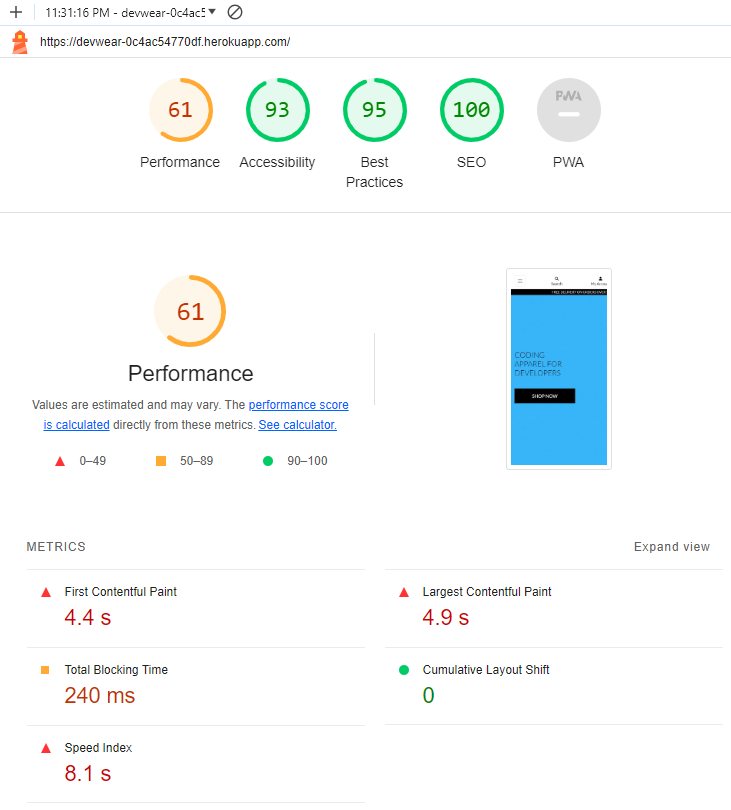

# DEVWEAR - Portfolio Project 5
Welcome To DevWear,
The Apparel Store for Developers!

[Link to live Website:](https://devwear-0c4ac54770df.herokuapp.com)

When designing this site, I wanted to keep the design simple. Due to time constraints I kept much of the CSS used in our walktough project. I do like the design and it is simple and clean. The goal of the site was to show that it can be quite simple to design and generate apparel products for Ecommerce

Build and SetupTechnologies:
This Ecommerce Project uses:
 HTML,
 CSS'
 Javascript' 
 Django,
 DJ Databases, 
 Psychopg Libraries,
 Postgres,
 Stripe Payments, 

 

## Responsive Layout

The layout is responsive and has been tested with various screen sizes. This screenshot was taken with the ui.dev/amiresponsive website.

## Product Design
All products were designed by myself with Canva and Printful. Most of the designs have been created in black and white. All designs have only two colours keeping them simple and getting the message accross clearly. 

Each image was created as below and then imported into printful to create mockups.

The Mockups were then converted into T-Shirt images for the store.

## Typography 

The Lato font family was used when creating and working on this project. I used Lato on Canva to produce the logo for the brand which matches the Lato Logo font used in the header of the site for the logo.

## Agile Development Process:

GitHub Projects
GitHub Projects served as the Agile tool for the Devwear project. Github used correctly  with the right tags and project creation/issue assignments can work nicely for project management. 

Below you can see the clearly planned out user stories and completed stories on the KANBAN Board. 

Through it, user stories, issues, and milestone tasks were planned, then tracked on a weekly basis using the basic Kanban board.

## User Stories
I used Excel to create a user story template and continued to create all user stories in Github projects.

### User Story List

USER STORY: <Navigate the Store Menu>#1
As a site visitor I can Navigate the Store Menu so that **See the Products and buy a product **

USER STORY: <Navigate the Store Products>#2
As a **Site Visitor ** I can Navigate the Products so that **See the Prices **

USER STORY: <Navigate the Categories>#3
As a Site Visitor I can Navigate the Product Categories so that **See the Categories **

USER STORY: <Easily view the total of my purchases >#4
As a Site User/shopper I can **Easily view the total of my purchases ** so that Avoid spending too much

USER STORY: <Easily register for an account >#5
As a Site user/Shopper I can **Easily register for an account ** so that **I have a personal account and view my profile **

USER STORY: <Easily Log in or Log out >#6
As a Site user/Shopper I can **Easily Log in or Log out ** so that Access my personal information

USER STORY: <Easily recover my password incase I forget it >#7
As a Site user/Shopper I can Easily recover my password in case I forget it ** so that ** I can recover access to my account

USER STORY: <Receive an email after registering >#8
As a Site user/Shopper I can **Receive an email after registering ** so that **Verify that my account registration was successful **

## Ecommerce Business Model & Marketing Strategy
This site sells goods to individual customers, and therefore follows a Business to Customer model. It is a simple B2C strategy, as it focuses on individual transactions, and doesn't need anything such as monthly/annual subscriptions.

The Target market for the business is we developers. 

Social media will be used to build a community of users around the business, and boost site visitor numbers, especially when using larger platforms such a Facebook.

A newsletter list can be used by the business to send regular messages to site users. For example, what items are on special offer, new items in stock, updates to business hours, notifications of events, and much more!

## Search Engine Optimization (SEO) & Social Media Marketing

The Seo is foucussed on people that like apparel and that are developers. The appropriate key words have been added to the Meta Section of base.html 

* Short-tail(head terms) keywors have been used
* Long-tail keywords have also been used.

### Sitemap 
[XML Sitemaps](https://www.xml-sitemaps.com/) was used to create the sitemap.xml file. 

### Robots

There is a robots.txt file present in the project. 

``User-agent: *
Disallow: /accounts/
Disallow: /profiles/
Disallow: /bag/
Sitemap: https://devwear-0c4ac54770df.herokuapp.com/sitemap.xml
``

## Social Media Marketing 

With Social Media making it fairly quick to get a decent media presence and exposure to the market a Facebook page is a great place to star. This is a live Facebook site and can be accessed here:

[Devwear Apparel Ltd](https://www.facebook.com/profile.php?id=61553925042570)

Below are some screenshots of the Facebook Page:

## Newsletter Marketing:
I have used the subscribe button at the bottom of the base.html file as advised in the course work this subscribes the user to a mailchimp database. This is temporary and will be upgraded at a later stage. 

## Testing 

### Lighthouse Testing
The Lighthouse Tests show the following results:

### CSS Validation
The W3C Validator approved the CSS for the app Url

