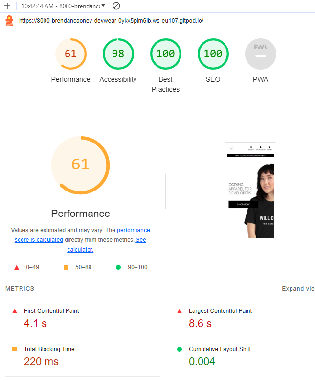

# Testing

I've run a lot of tests throughout the project's development to make sure the website functions properly. All of the site's testing are documented in this area.

# Code Validation
Index Page:

### CSS Validation
The W3C Validator approved the CSS for the app Url

### Lighthouse Testing
The Lighthouse Tests show the following results:

### Python Testing:

